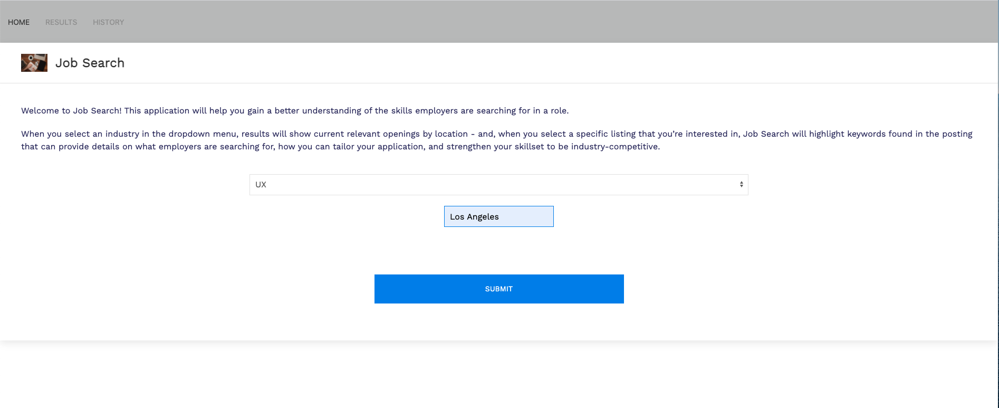
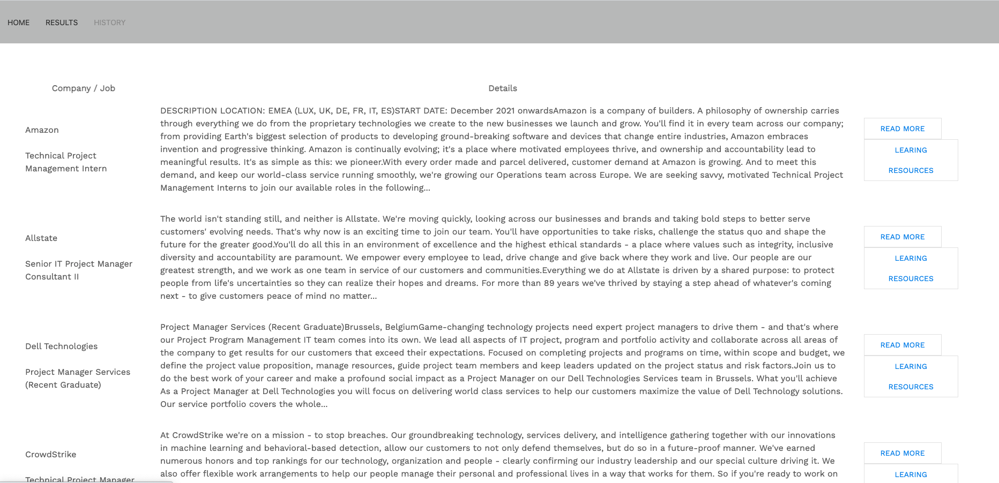
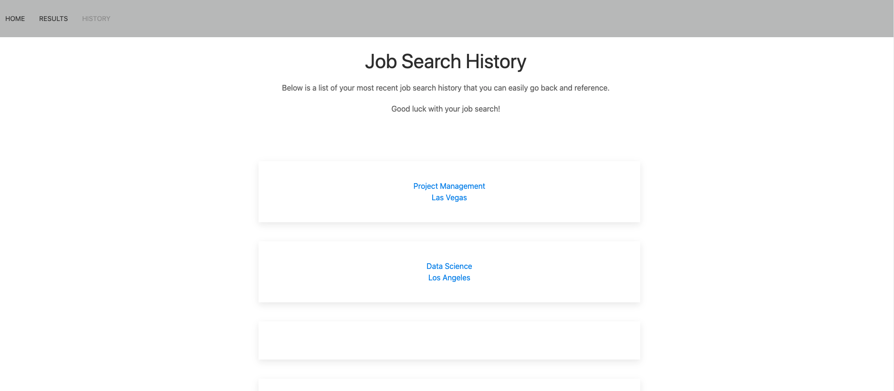

# Job Search Project 1 Application

## Description
This application will help a user to search for job listings based on their skills or interests, and will send a response to the Muse API to then show job listings to the user. The user can select a job listing and the application will then use the Learning Objects API to take the listing and link an external learning resource that can help the user understand the specific skill(s) that this particular job opportunity is looking for; additionally, these learning resources can guide the user’s job application process, whether it be updating their resume, learning or strengthening their skillset. 

## User story:
AS A PROFESSIONAL searching for my next employment opportunity, 

I WANT to use an application that allows me to search for a job listing based on job industry, 

AND SHOW results of the search 

SO that I can get a good understanding of current openings

AND ways to strengthen my knowledge.

## Installation
For installation and deployment, please [click here](https://kimberly-rodriguez.github.io/job-search/). The GitHub link is [here](https://github.com/kimberly-rodriguez/job-search/).

## Usage
The user can easily search for job listings by selecting an industry they're interested in from the dropdown menu. After the user enters the city location, the application will take the user to a second page that pulls five relevant job postings, including the title, location, and a portion of the job description. Finally, the page provides two links: the first link ("Read More") takes the user to the actual job posting; the second link ("Learning Resources") will take the user to an external resource that provides educational learning materials based on the job title. Lastly, there is a History tab on the navigation bar that shows the user's search history; this way, they can easily click on previous searches to pull up relevant postings rather than starting over. The following images show the web application's appearance through the landing page, followed by the results and search history:

## Contributors

- Ezequiel Martinez: <martinez.ezequiel42@gmail.com>
- Kimberly Rodriguez: <krodriguez.ucla@gmail.com>
- Chris Tolnai: <christolnai@gmail.com>
- Candice Wu: <candice.ying.wu@gmail.com>

## License and copyright

(c) Ezequiel Martinez, Kimberly Rodriguez, Chris Tolnai and Candice Wu 

Licensed under the [MIT License](LICENSE).